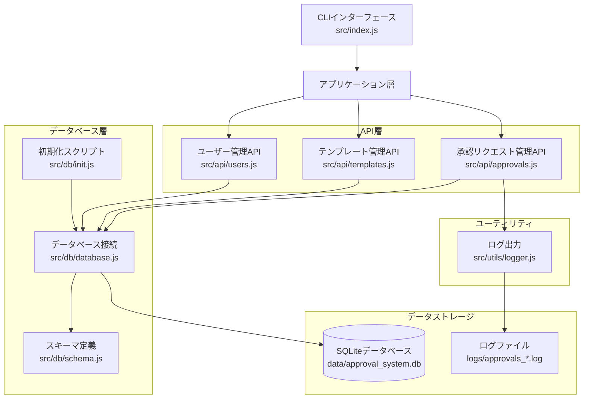
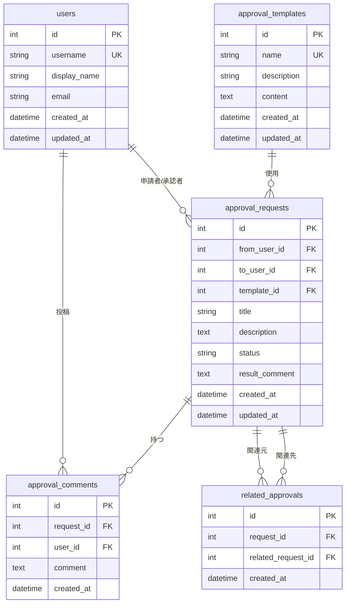
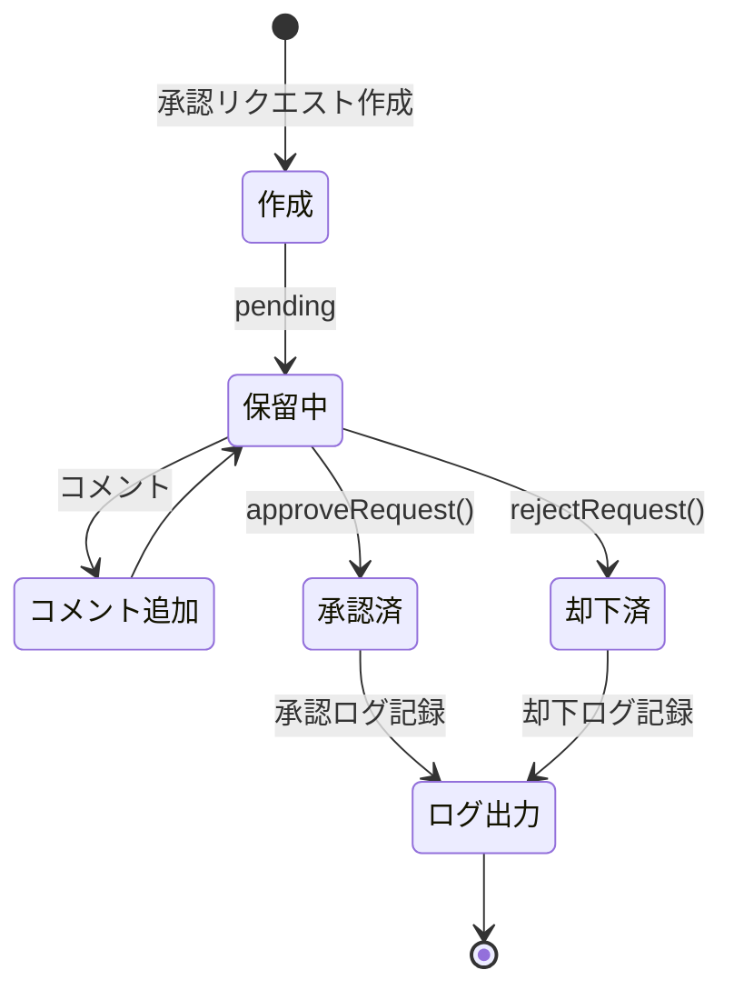
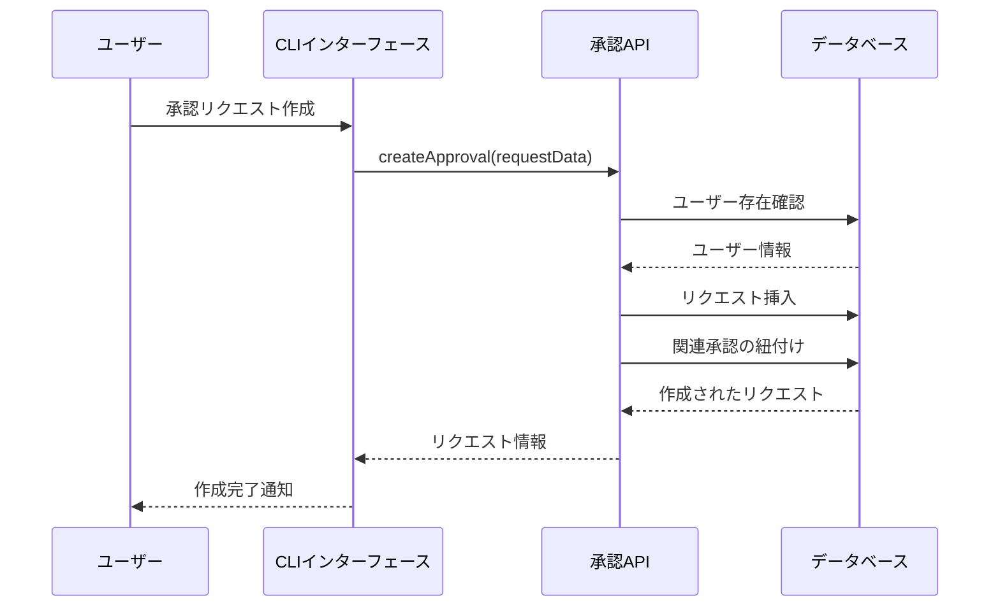
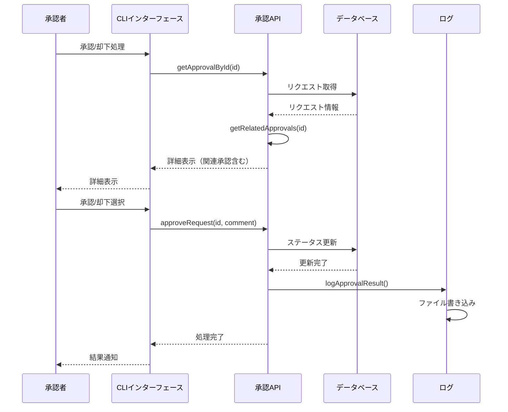

# システムアーキテクチャ

## システム構成図

## データベーススキーマ

## 承認フロー

## 機能別処理フロー

### 承認リクエスト作成

### 承認/却下処理

## セキュリティ対策

1. **SQLインジェクション対策**
   - Prepared Statements（プリペアドステートメント）を使用
   - better-sqlite3のパラメータバインディング機能を活用

2. **外部キー制約**
   - データの整合性を保証
   - CASCADE DELETE設定によるデータ削除の連鎖

3. **入力検証**
   - 必須項目のチェック
   - ユーザー存在確認
   - 一意制約の検証

4. **ログ記録**
   - すべての承認/却下処理をログファイルに記録
   - 監査証跡の確保

## 拡張性

システムは以下の拡張が容易です：

1. **Webインターフェースの追加**
   - Express.jsサーバーの追加
   - REST API エンドポイントの実装
   - フロントエンドUIの追加

2. **認証・認可の追加**
   - ユーザー認証機能
   - ロールベースアクセス制御（RBAC）
   - セッション管理

3. **通知機能**
   - メール通知
   - Slack/Teams連携
   - プッシュ通知

4. **ワークフロー機能**
   - 複数承認者の設定
   - 承認フローの定義
   - エスカレーション機能

5. **レポート機能**
   - 承認統計の表示
   - ダッシュボード
   - エクスポート機能
